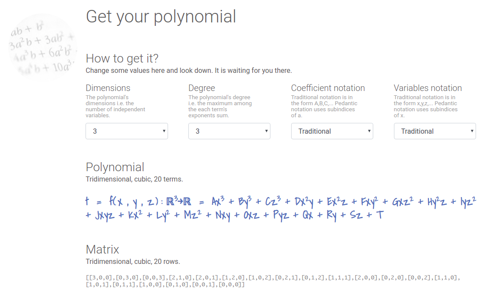

# polygone





Based on the very useful https://github.com/SRC-technology/lab-template.bootstrap-reason-react-app

## Install

You can install all the needed dependencies by running `yarn`.

```sh
$ yarn
$ yarn build
```

## View


```
$ yarn global add serve
$ serve
```
I promise you a very nice README.md soon. Stay tuned.


